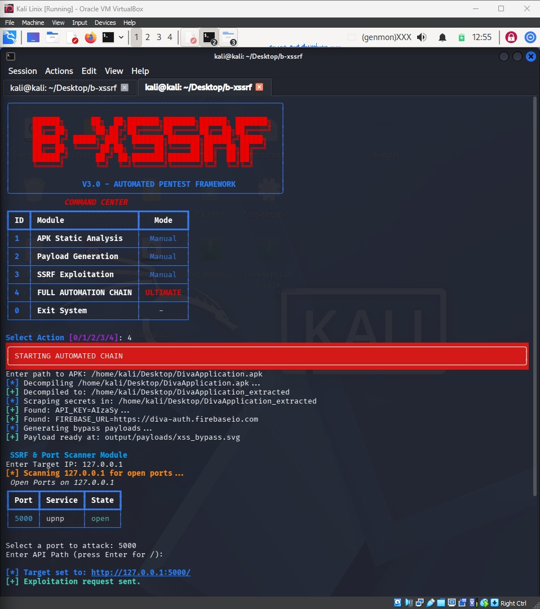

# B-XSSRF v7 🛡️

## 📌 Overview
**B-XSSRF v7** is an advanced **End-to-End Automated Penetration Testing & Security Auditing Framework** engineered for mobile applications (Android) and backend infrastructure. The framework completely automates the security assessment lifecycle—from static analysis and deep decompilation to custom payload generation, live exploitation verification, and highly structured security reporting.

---

## 📝 Screenshots

Here is a look at the **B-XSSRF v7** interactive console and its automated workflow:



---

## 📝 Terminal Interface

The modern interactive console layout features an intuitive menu structure:

```text
 ____        __  ______ ____  ____  _____ 
| __ )       \ \/ / ___/ ___||  _ \|  ___|
|  _ \   ___  \  /\___ \___ \| |_) | |_   
| |_) | |___| /  \ ___) |__) |  _ <|  _|  
|____/       /_/\_\____/____/|_| \_\_|    

 B-XSSRF v7
 User: Mazen El-Gammal
```
🔹 Core Modules
[1] MOBILE AUDIT → Fast static manifest parsing and initial risk checking.

[2] INFRASTRUCTURE → Internal network mapping and service discovery.

[3] ATTACK CHAIN → Context-aware logical sequencing of coupled vulnerabilities.

[4] AUTO EXPLOIT → The complete end-to-end automation engine.

[0] EXIT → Gracefully terminate the framework environment.

🚀 The Full Automation Chain (Option 4)
When executing the Full Automation Chain, B-XSSRF runs a meticulous 5-phase operation against the target APK:

🔄 Execution Lifecycle Breakdown
[1/5] Static Analysis: Instantly maps high-level parameters (Debuggable, AllowBackup) and extracts rapid manifest insights into a structured matrix.

[2/5] Deep Secrets Scan: Decompiles the codebase down to smali/resources to uncover hidden endpoints, custom strings, hardcoded passwords, and sensitive user data.

[3/5] Payload Generation: Dynamically crafts context-aware exploitation payloads (e.g., SVG/XML vectors, path traversal arrays, or SSRF fuzzing schemes) based on the discovered components.

[4/5] Live Exploitation & Verification: Checks for active device connections via emulation environments to perform runtime validation (like active JDWP debug hooks or automated backup extractions).

[5/5] Final Report Generation: Aggregates findings into a high-visibility execution table containing phase breakdowns, specific evidence logs, and defensive remediation recommendations.

## 📊 Comprehensive Security Reporting
Upon completion, the framework presents a Detailed Vulnerability Report directly in the console terminal:

| Phase | Key Findings & Data |
| :--- | :--- |
| **1. Manifest Risks** | Debuggable = true (CRITICAL) <br> AllowBackup = true (HIGH) |
| **2. Secrets (Manifest)** | Rapid scan logs (e.g., Target infrastructure assets) |
| **3. Deep Scan** | Decompiled resource highlights (Endpoints, Passwords, Usernames) |
| **4. Generated Payloads** | Dynamic exploitation vectors mapped to extracted schemas |
| **5. Live Exploitation** | JDWP code execution paths / ADB backup vulnerability verification |
| **6. Network/Infra Scan** | Targeted service auditing context |
| **7. Recommendation** | Actionable remediation rules (e.g., disabling debug flags in prod) |

> 💡 *The framework prompts the engineer instantly with interactive options to save the complete report locally for documentation purposes.*

📖 Quick Usage
Launch the master orchestration script:

Bash
python3 main.py
Choose 4 to enter the automated assessment chain.

Input the destination path to your test application:

Plaintext
[+] Enter APK Path: /home/kali/Desktop/DivaApplication.apk
⚠️ Disclaimer
This framework is built strictly for authorized penetration testing, industrial security auditing, and academic research. Operating this utility against unauthorized environments without proper written approval is explicitly prohibited. The author holds no liability for downstream infrastructure damages or alignment issues caused by inappropriate usage.

👨‍💻 Author
Mazen El-Gammal Cybersecurity Researcher & Core Developer [GitHub Profile](https://github.com/mazen-elgammal10) | [LinkedIn]([https://linkedin.com](https://www.linkedin.com/in/mazen-el-gammal-1934a1291/)
